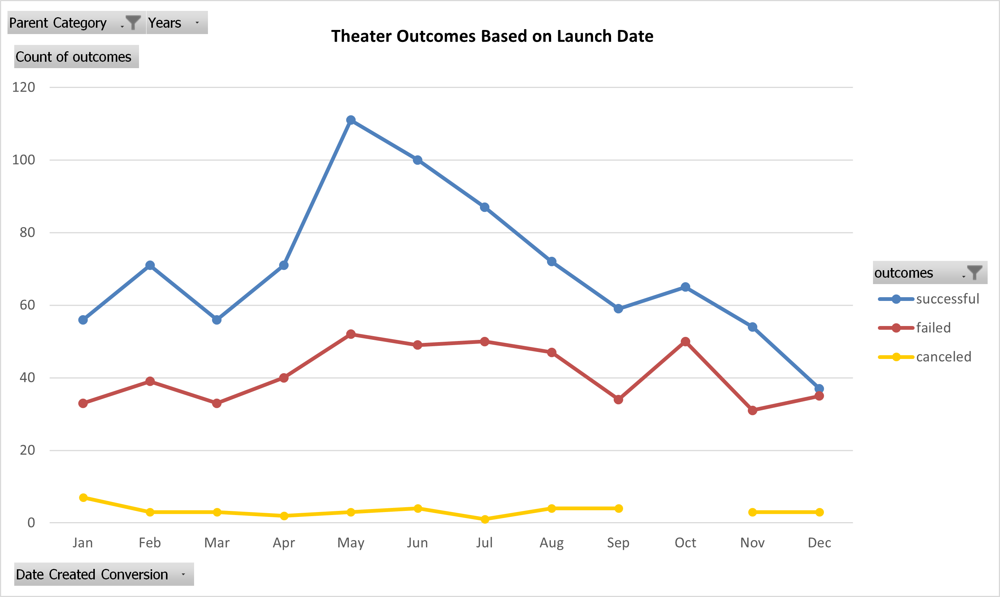

# Kickstarting with Excel

## Overview of Project

### Purpose

###### The purpose of this analysis is to gain the ability and insight to suggest parameters for Louise's fundraising theater/plays campaign to achieve optimal results.

## Analysis and Challenges

###### To perform the Kickstarter analysis, I utilized the Kickstarter dataset in conjunction with Microsoft Excel Pivot tables, Pivot Charts, COUNTIFS formulas, and line charts. During moments of uncertainty, I referenced Microsoft Office Support and Module One notes for help on COUNTIFS formulas, Pivot tables, and Pivot Charts. Another challenging aspect I encountered while working on Module One was setting up Git Bash and the SSH key, then learning how to properly push and pull to and from GitHub. Thanks to the help of Teaching Assistants, Artem and Jacob, I learned how to properly set up Git Bash using a working SSH key and how to push/pull to and from GitHub!

### Analysis of Outcomes Based on Launch Date

###### Two conclusions to draw about the Theater Outcomes by Launch Date is that the month of May would be the ideal month to execute the fundraising campaign for her theater project and to use November through March for time to plan and effectively prepare for the fundraising campaign. The end of the year, November and December, and into the new year, January through March, were the least successful months and therefore Louise should use November through March to plan and prepare the fundraising campaign. It was also determined using Mean, Median, and Mode formulas on the duration (in days) of each campaign that 30 days is the ideal duration for a successful fundraising campaign. Therefore Louise's campaign should launch at the beginning of May and conclude at the end of the month to achieve optimal results.

### Analysis of Outcomes Based on Goals

###### Based on the Outcomes Based on Goal analysis, it has been determined that the financial goal of $1000 or less was the most successful goal benchmark at a 76% success rate. The next most successful goal benchmark is $1000 to $4999 at a 73% success rate. It can be concluded that Louise should set a goal no greater than $5000 in order to achieve the greatest possibility of success.

### Challenges and Difficulties Encountered

###### In my opinion, I believe the data set is thorough. During my final analysis, I temporarily added a Duration (in Days) column to calculate the duration of each campaign. Then I used the measures of Central Tendency, Mean, Median, and Mode formulas, to determine that 30 days is the ideal duration for a successful fundraising campaign. If the fundraising campaign was too long or short in duration compared to 30 days, it might not be as successful.

###### Another analysis that could be beneficial is an analysis based on country to determine which countries garnered more success than others. It is possible some countries value theater and plays more greatly than other countries, and therefore might not significantly contribute to Louise's fundraising campaign.
